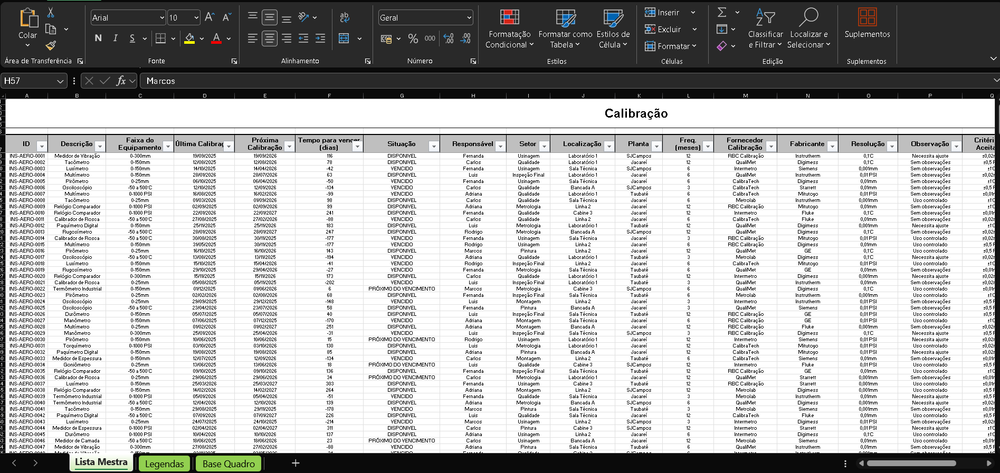
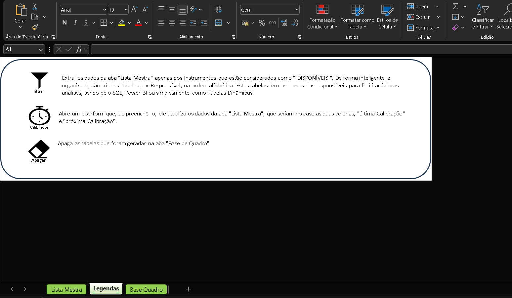
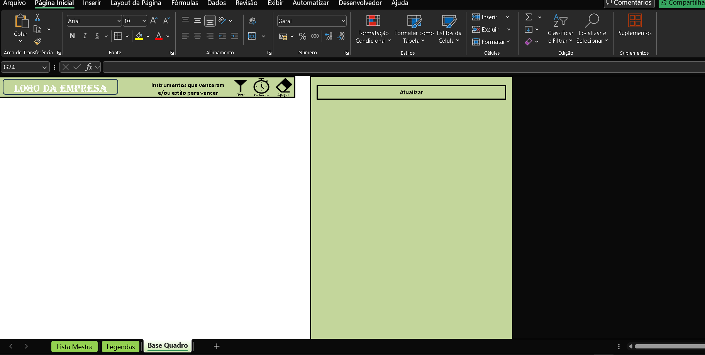
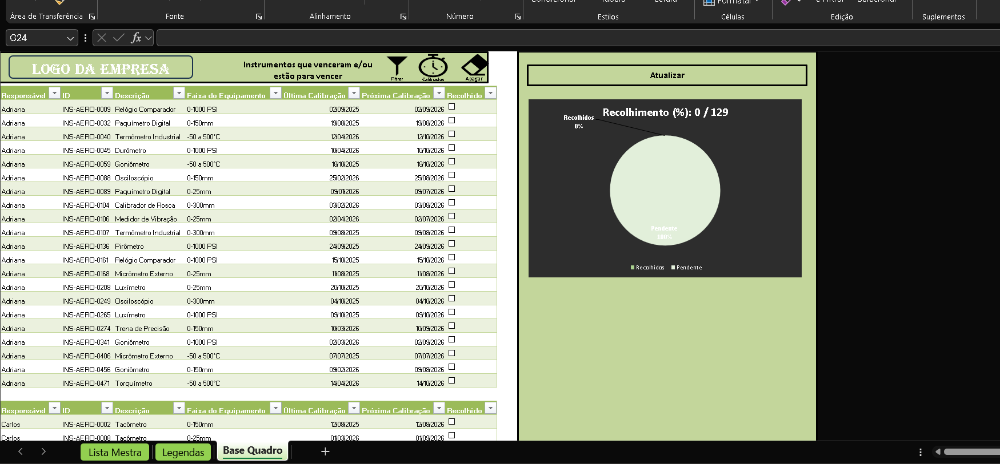
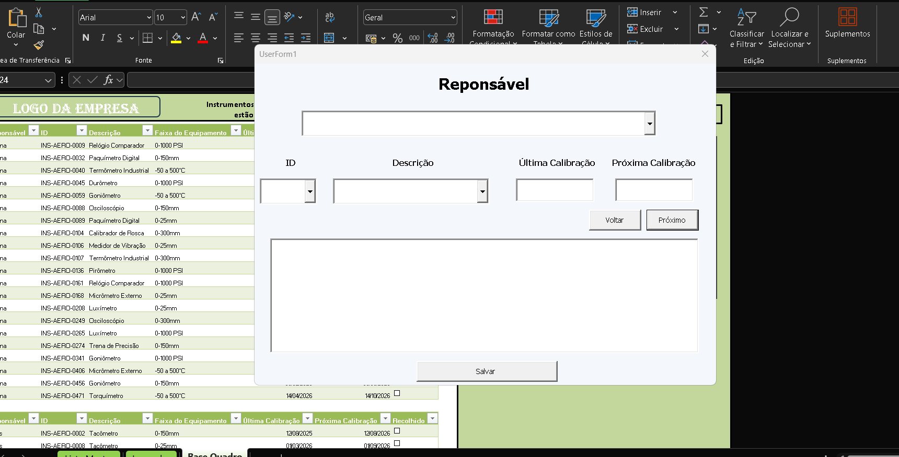

# Calibration Control System

Automated calibration instrument management and analysis system developed with Excel VBA.

---

## Overview

This project was developed to optimize the control and monitoring of calibration instruments through automation and intelligent data organization.

The system improves operational efficiency by reducing manual work and accelerating the identification of instruments approaching calibration expiration.

---

## Problem

The analyst previously used a highly manual spreadsheet containing only the “Master List” worksheet.

To identify instruments approaching calibration expiration, it was necessary to filter records one by one, which could take several hours to locate valid instruments within a specific date range.

Separating instruments by responsible personnel was also a time-consuming task, reducing operational efficiency and increasing manual workload.

---

## Proposed Solution

Using VBA automation, a smarter and more efficient system was developed while keeping the original “Master List” structure unchanged, according to the analyst’s preference.

With only a few clicks, the system automatically organizes and separates instruments, making the process significantly faster and more practical.

Tasks that previously required hours can now be completed in just a few minutes, greatly improving productivity and reducing manual effort in the calibration management process.

---

## Main Features

- Automated calibration control
- Instrument expiration filtering
- Automatic organization by responsible personnel
- Intelligent data separation
- Dashboard visualization
- VBA automation processes
- Faster analysis workflow
- User-friendly interface

---

## Technologies Used

- Excel VBA
- Microsoft Excel
- Process Automation
- Dashboard Design
- Data Analysis

---

## Project Structure

```bash
📁 screenshots
📁 docs
📄 Calibration_Control_System.xlsm
📄 README.md
```
---

## System Screenshots

### Main Screen



---

### Legends



---

### Raw Dashboard Base



---

### Filtered Dashboard Base



---

### Calibration Update UserForm


---

## Future Improvements

* Development of intelligent performance indicators and advanced analytics
* Interactive Power BI dashboard integration
* Smart automatic report generation by responsible personnel
* Intelligent one-click printing system for individual responsible reports
* Multi-user support and access management
* Advanced dashboard
* Enhanced automation workflows


---

## Author

Marcos Vitor Ferreira Souza
